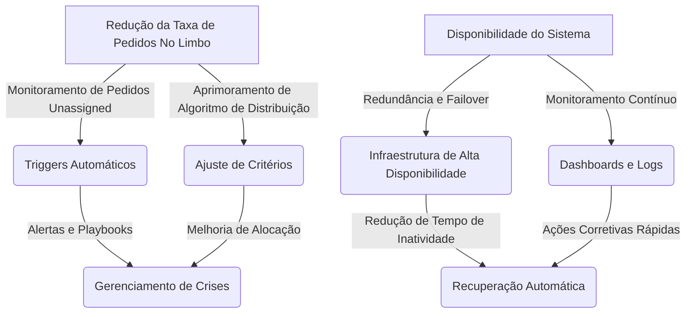

# 📌 Teste do Business Drivers

## 📖 Visão Geral
Este repositório documenta a implementação e testes automatizados dos Business Drivers do projeto. O foco está na redução da taxa de pedidos "no limbo" (DN1) e na garantia da disponibilidade do sistema (DN2).

## 🗺️ Mapa dos Business Drivers

